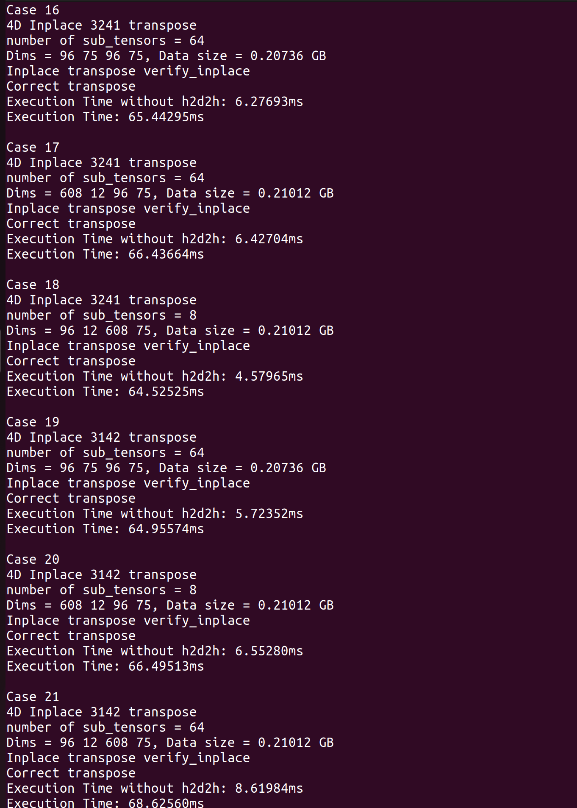
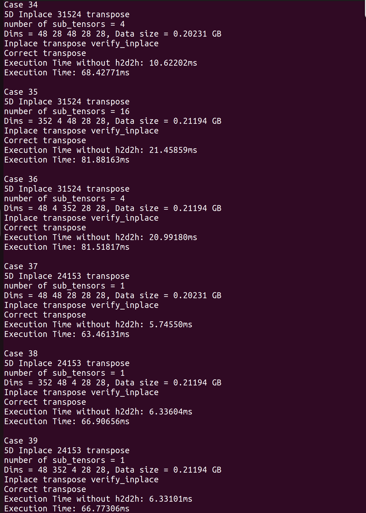

# EITHOT: Efficient In-place Transposition of High Order Tensors on GPUs

Tensor transposition is a fundamental operation in many applications, but naive implementations require double the memory and aren't suitable for large-scale tensors on memory-limited GPUs. To address this, EITHOT is presented as an efficient algorithm for in-place tensor transposition on GPUs, requiring at most 5% additional memory for large tensors.

## Algorithm
---
EITHOT is based on the following steps:

1. Factorize high-order tensors into a sequence of low-order transpositions using permutation decomposition.
2. Divide large tensors into smaller ones based on the estimation of required extra memory and transpose each separately.
3. Reassemble the transposed sub-tensors to obtain the desired result.

## Environment
---
The following environment was used to develop and test EITHOT:

- Operating System: Ubuntu 22.04
- GPU: NVIDIA RTX 3090
- CUDA Toolkit: 12.0

If you plan on using a GPU that's different from the above one, it's crucial to verify that your GPU is compatible with the CUDA version you're using. Additionally, you may need to make modifications to the "NVCCFLAGS" in the Makefile to ensure that the architecture is properly aligned with your GPU. To assist in this process, you can refer to the website <https://arnon.dk/matching-sm-architectures-arch-and-gencode-for-various-nvidia-cards/> to find the corresponding architecture for your GPU.

## Getting start
---
To build and install EITHOT, follow these steps:
1. Clone the repository:
```
$ git clone https://github.com/kano89125/EITHOT.git
```
2. Navigate to the **Nd_memory_estimation** directory and Build the project using the Makefile:
```
$ cd Nd_memory_estimation
$ make
$ cd ..
```
3. Navigate to the **ITNT** directory and Build the project using the Makefile:
```
$ cd ITNT
$ make
$ cd ..
```
## Usage
---
### Input Format
The input to EITHOT consists of the following parameters, separated by spaces:
1. Dimensions: A sequence of integers indicating the size of each dimension of the tensor, in order. For example, "2 41961 8192 2" specifies a 4-dimensional tensor with dimensions (2, 41961, 8192, 2).

2. Permutation: A sequence of integers indicating the desired permutation of dimensions for the transposition, using the 1-based index of each dimension. For example, "1 3 2 4" specifies that the tensor should be transposed by swapping the second and third dimensions.

3. Element Size: The size of each element in bytes. For example, "4" indicates that each element is a 32-bit (4-byte).

4. Number of Sub-Tensors: An integer indicating the number of sub-tensors to split the input tensor into.

5. Expected Extra Memory Ratio: A floating-point number indicating the maximum expected ratio of extra memory usage during the transposition.

For example, "2 41961 8192 2 1 3 2 4 4 1 0.01" specifies a 4-dimensional tensor with dimensions (2, 41961, 8192, 2), to be transposed by swapping the second and third dimensions. Each element is a 32-bit integer (4 bytes), and the tensor should be split into 1 sub-tensor. The expected extra memory usage ratio is 1%.

### Test
We provide a script called **test_INT.sh** in both the **Nd_memory_estimation** and **ITNT** folders. To use the script, first navigate to the **Nd_memory_estimation** folder and run the script with the following command:
```
$ ./test_INT.sh
```
In the script, you need to specify the input format, including the dimensions size, permutation of dimensions (a permutation of sequence 1~n), element data size in bytes, number of sub-tensors, and expected ratio of extra memory usage. For the number of sub-tensors, use 1 to start with a single sub-tensor.

After you run the script, the program will estimate the optimal number of sub-tensors for the tensor transposition. 

Next, navigate to the **ITNT** folder and run the **test_INT.sh** script again with the following command:
```
$ ./test_INT.sh
```
This time, the script will perform the tensor transposition and output the elapsed time.

### Benchmark
To use the **Bench.sh** script, first make sure to copy the **test_inplace** and **Nd_estimation** from another two folders into the Benchmark folder. Once you've done that, navigate to the Benchmark folder and run the script using the following command:
```
$ ./Bench.sh task_id
```
Here, "task_id" should be a number from 1 to 6, corresponding to the six different experiments in our work.


For Experiment 6, you will need to modify a variable in the **ITNT/src/Nd_transpose.cpp** file. Open the Nd_transpose.cpp file, and locate the variable **REORDER_TYPE**. This variable determines how the program will perform the reordering step.

You can change the value of the variable as follows:

- 0: mix order
- 1: pre-order
- 2: post-order

Then **make** again and copy **test_inplace** to Benchmark folder. 

### Example

In this section, we will use Experiment 2 as an example. After executing **./Bench.sh 2**, the script will run through all the test case files under **./test_cases/exp2**. Since Experiment 2 has only one test case file, it will run only one file.

For each test case, the script will first estimate the optimal values for the number of subtensors and alpha to achieve better performance. This step will also show the additional memory required in this case. After estimating the optimal values, the script will start the transposition process.

For each test case, the script will display its information, including the transpose permutation, the size of the tensor, number of subtensors, and alpha. It will then show the correctness and benchmark results. After finishing all the test cases in a file, the script will output the statistical results and move the benchmark results to the folder with the same name as the test case file. The result folder will be placed beside the test case file in the same directory.








